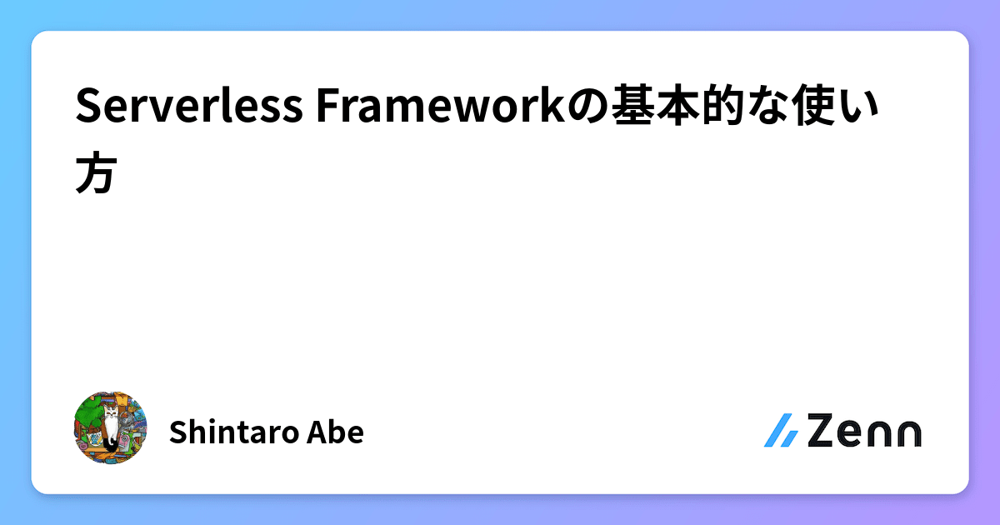
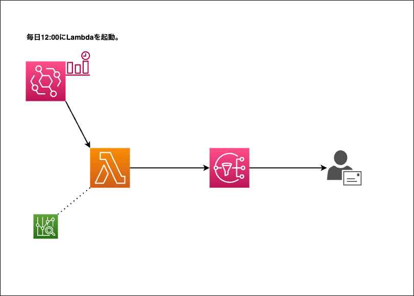

# serverless-practice
## Refferemce article
Zennに投稿した、「Serverless Frameworkの基本的な使い方」に掲載したコードを収録したリポジトリ。

<a href="https://zenn.dev/lifewithpiano/articles/serverlessframework2304">

## Summary
毎日12時にEventbridgeでAWSの請求額を取得するLambda関数を起動させ、SNSから通知メールを送信するシステム。
Serverless Frameworkを使用するので、あえてStepFunctionsを使用して構築。



* __プラグインのインストール__
serverless stepfunctionsプラグインをインストール。
尚、resourceセクションにCloudFormation構文で記述する方法でも作成可能。
```
sudo npm install --save-dev serverless-step-functions
```

## Regarding source code

#### serverless.yml 【part.1】

* providerセクションにLambdaの実行ロールを定義。
CloudWatch Logsのポリシーは自動的に付与。他にアタッチするポリシーを記述。
ロググループを自動で生成。
* stepFunctionsセクションでEventBridgeを定義。
stepFunctionsセクションで作成すると、実行に必要なポリシーをアタッチしたロールを自動で作成。
EventBridgeが使用するロールはresourceセクションで定義が必要。
ロググループはresourceセクションで定義が必要。stepFunctionsセクションで関連付けを行うと、必要なポリシーを自動でアタッチ。

Serverless Frameworkの機能を活用した方が、テンプレートに記述する量が少ない。

__自動で付与されるポリシー__

| サービス | ポリシー|
| :---| :--- |
| Lambda |logs:CreateLogStream<br>logs:CreateLogGroup<br>logs:TagResource<br>logs:PutLogEvents|
| StepFunctions | 実行に必要なポリシー。 |

#### serverless.yml 【part.2】
LambdaとStepFunctions以外のリソースをresourceセクションで作成。

#### cost.py
[Developers IO 藤井元貴さん作成のapp.py](https://dev.classmethod.jp/articles/notify-slack-aws-billing/)を参考にさせていただきました。

